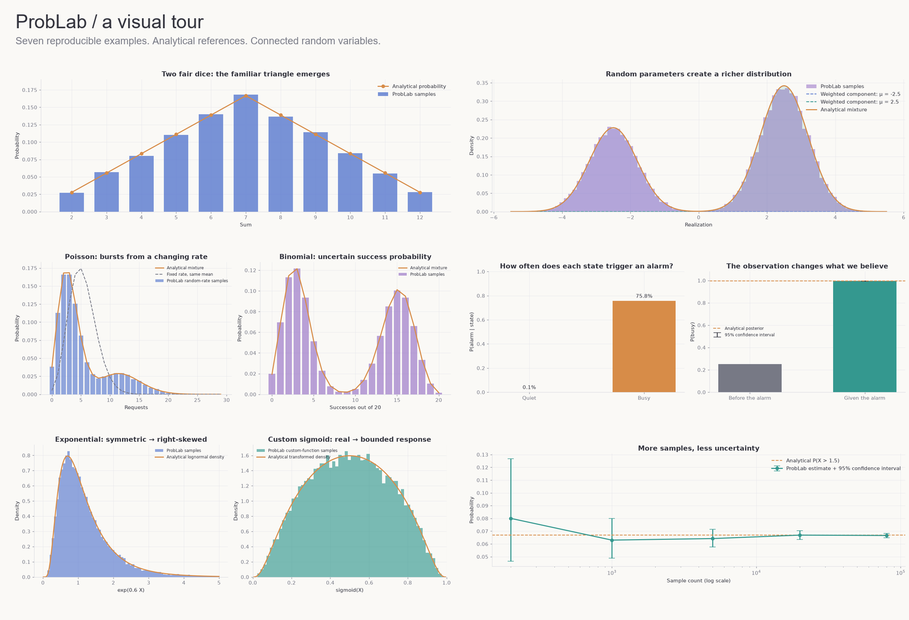

# ProbLab visual demo

Open [problab_showcase.ipynb](problab_showcase.ipynb) for seven illustrated examples.
The saved outputs include the plots, so you can browse the notebook before running it.



## Run it

From the repository root in PowerShell:

```powershell
.\.venv\Scripts\python.exe -m pip install -e .
.\.venv\Scripts\python.exe -m pip install jupyterlab ipykernel
.\.venv\Scripts\python.exe -m jupyter lab demo/problab_showcase.ipynb
```

Select the repository's **.venv** interpreter/kernel and choose **Run All**.
In PyCharm or VS Code, you can open the notebook directly and select that interpreter.
If Jupyter does not offer it, register it once:

```powershell
.\.venv\Scripts\python.exe -m ipykernel install --user --name problab --display-name "Python (ProbLab)"
```

The notebook uses the library's public API. All ProbLab statistics in this tour use
Monte Carlo sampling; analytical reference curves are calculated separately with
NumPy, explicit formulas, or SciPy. Each experiment uses a fresh fixed seed.
Reproducibility assumes the same Python and dependency versions.

## Contents

1. Independent dice and their sum.
2. Shared dependencies versus independent draws, with a dependency graph.
3. A Gaussian mixture with a random mean, with its dependency graph.
4. Poisson and Binomial distributions with random parameters.
5. Conditional probability and Bayes' rule.
6. Exponential and custom sigmoid transformations.
7. Probability intervals, quantile confidence intervals, and Monte Carlo precision.

This folder contains demo artifacts only; the library and test suite are unchanged.
